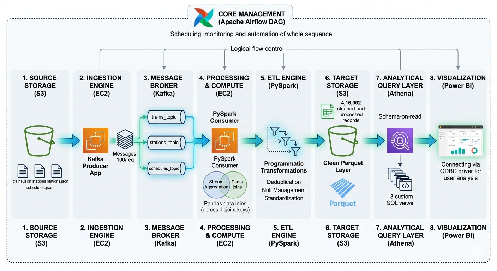

# 🚂 Real-Time Indian Railway Data Pipeline


An end-to-end Big Data Engineering Pipeline that ingests Indian Railway data from AWS S3, streams it through Apache Kafka, processes and cleans it using PySpark, stores analytics-ready data in Parquet format on AWS S3, enables SQL-based analysis with AWS Athena, and visualizes insights using Power BI dashboards.

---

## 📌 Project Overview

This project demonstrates a complete cloud-based data engineering workflow for processing large-scale Indian Railway datasets. The system utilizes distributed technologies to handle ingestion, transformation, storage, analytics, orchestration, and visualization.

### Dataset Statistics

| Metric         | Value    |
| -------------- | -------- |
| Raw Records    | 4,17,080 |
| Clean Records  | 4,16,002 |
| JSON Files     | 3        |
| Kafka Topics   | 3        |
| Athena Views   | 11       |
| Final Columns  | 23       |
| Storage Format | Parquet  |

---

## 🎯 Objectives

* Build a real-time railway data ingestion pipeline.
* Stream data using Apache Kafka.
* Process and clean data using PySpark.
* Store transformed data in AWS S3.
* Perform analytics using AWS Athena.
* Automate execution using Apache Airflow.
* Visualize insights using Power BI.
* Implement a scalable cloud-based architecture.

---

## 🏗️ Architecture

```text
AWS S3 (Raw JSON Files)
        │
        ▼
Kafka Producer (AWS EC2)
        │
        ▼
Kafka Topics
├── trains_topic
├── stations_topic
└── schedules_topic
        │
        ▼
PySpark Consumer (AWS EC2)
        │
        ▼
Data Cleaning & Transformation
        │
        ▼
AWS S3 (Parquet Files)
        │
        ▼
AWS Athena
        │
        ▼
Power BI Dashboard

        ▲
        │
Apache Airflow
(Pipeline Orchestration)
```

---


## 🔄 Pipeline Workflow

1. **Raw Data** — 3 JSON files uploaded to S3 bucket
2. **Producer** — reads files from S3, sends to 3 Kafka topics in batches of 100
3. **Kafka** — buffers messages across 3 topics
4. **Consumer** — reads all 3 topics, joins using Pandas, cleans with PySpark
5. **PySpark ETL** — removes nulls, duplicates, standardizes data
6. **S3 Storage** — saves 4,16,002 clean records as Parquet
7. **Athena** — creates 13 SQL views for analysis
8. **Power BI** — connects via ODBC, displays dashboard
9. **Airflow** — automates entire pipeline on schedule

---

## 📁 Project Structure

```
railway-pipeline/
│
├── producer/
│   └── producer.py          # Reads JSON from S3, sends to Kafka
│
├── consumer/
│   └── consumer.py          # Reads Kafka, joins, cleans with PySpark, saves to S3
│
├── airflow/
│   └── dags/
│       └── railway_pipeline.py   # Airflow DAG for automation
│
├── athena/
│   └── queries.sql          # All Athena SQL queries and views
│
├── docs/
│   └── pipeline_flow.png    # Architecture diagram
│
├── requirements.txt         # Python dependencies
├── .gitignore              # Ignore sensitive files
└── README.md               # Project documentation
```

---

## 🛠️ Technology Stack

| Layer               | Technology             |
| ------------------- | ---------------------- |
| Cloud Platform      | AWS                    |
| Data Storage        | AWS S3                 |
| Message Broker      | Apache Kafka           |
| Data Processing     | Apache Spark (PySpark) |
| Workflow Automation | Apache Airflow         |
| Analytics Engine    | AWS Athena             |
| Dashboard           | Power BI               |
| Language            | Python                 |
| Operating System    | Ubuntu                 |
| Runtime             | Java 11                |

---

## ✨ Key Features

* Real-time streaming architecture
* Distributed ETL processing
* Kafka-based message ingestion
* PySpark data cleaning and transformation
* AWS S3 Data Lake storage
* Athena serverless analytics
* Power BI dashboard reporting
* Airflow orchestration
* Cloud-native deployment
* Parquet optimized storage

---

## 📊 Analytics Generated

* Gold Base View – Creates analytics-ready railway data with derived business metrics.
* Zone Performance – Measures zone-wise delays and punctuality.
* Busiest Source Stations – Finds stations with the highest train departures.
* Train Type Distribution – Analyzes train category proportions.
* State Performance – Compares railway performance across states.
* Cancellation Trend – Tracks cancellation rates over time.
* Speed Zone Distribution – Classifies train speeds by railway zone.
* Expensive Routes – Identifies premium-priced railway routes.
* Electrification Impact – Evaluates performance of electrified routes.
* Departure Delay Analysis – Studies delay patterns by departure time.
* Journey Pricing Analysis – Compares ticket prices across journey distances.

---

## 📈 Results

| Metric                  | Result   |
| ----------------------- | -------- |
| Raw Records Processed   | 4,17,080 |
| Clean Records Generated | 4,16,002 |
| Kafka Topics Used       | 3        |
| Athena Views Created    | 5        |
| Output Format           | Parquet  |
| Deployment Platform     | AWS      |
| PowerBI                 | Report   |

---

## 🚀 Future Enhancements

* Real-time streaming dashboards
* Kafka multi-partition scaling
* AWS Glue integration
* Data quality monitoring
* Machine learning-based railway analytics
* Kubernetes deployment
* CI/CD automation

---

## Team 11 | CDAC Project

| Team Member |
|---|
| Shubham |
| Mayur |
| Riyas |
| Dhiraj |
| Harshvardhan |

---
---

## 📜 License

This project was developed for academic and learning purposes as part of a Big Data Engineering implementation project.
